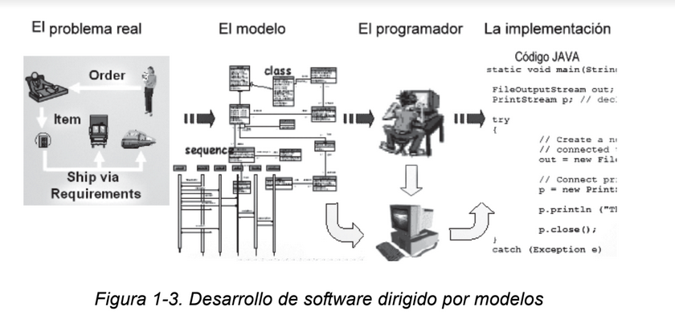
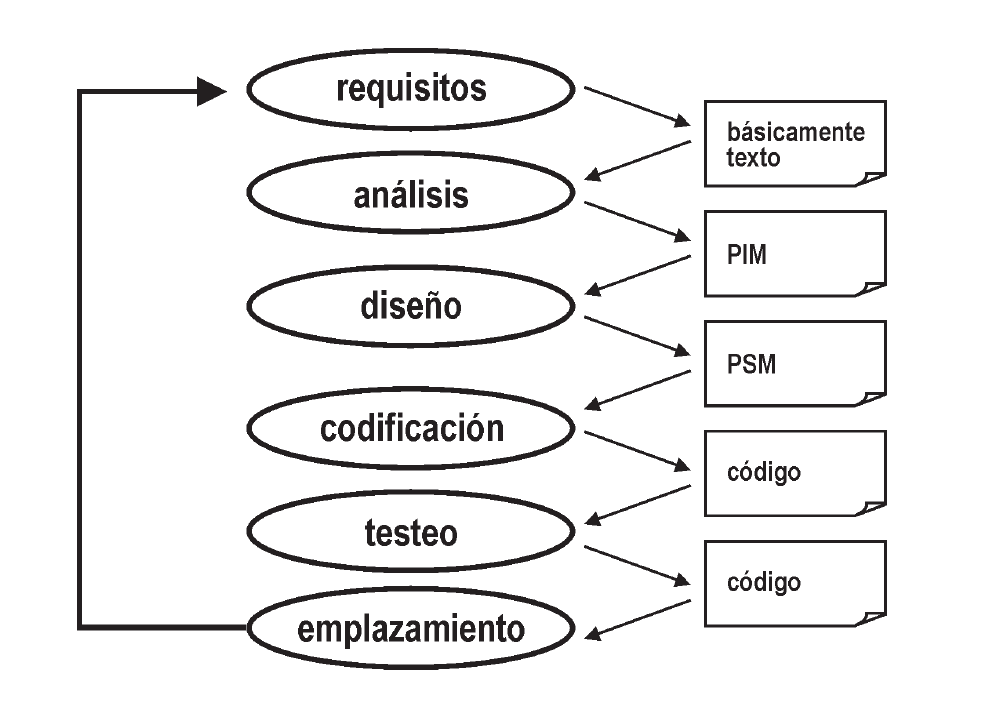
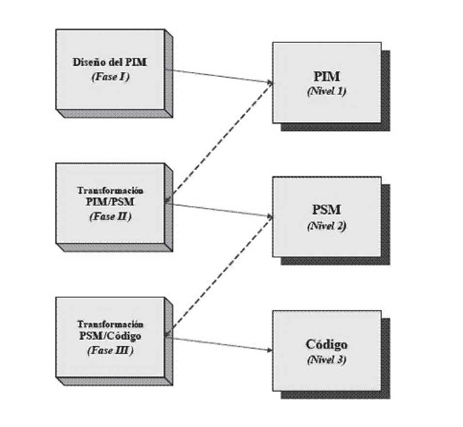

# 1.3 El desarrollo de software dirigido por modelos (MDD) 

El Desarrollo de Software Dirigido por Modelos MDD (por sus siglas en inglés: Model Driven software Development) se ha convertido en un nuevo paradigma de desarrollo software. MDD promete mejorar el proceso de construcción de software basándose en un proceso guiado por modelos  y soportado por potentes herramientas. El adjetivo “dirigido” (driven) en MDD, a diferencia de “basado” (based), enfatiza que este paradigma asigna a los modelos un rol central y activo: son al menos tan importantes como el código fuente. Los modelos se van generando desde los más abstractos a los más concretos a través de pasos de transformación y/o refinamientos, hasta llegar al código aplicando una última transformación.
La transformación entre modelos constituye el motor de MDD.

Los puntos claves de la iniciativa MDD fueron identificados en [Booch 04b] de la siguiente forma:

1. El uso de un mayor nivel de abstracción en la especificación tanto del problema a resolver como de la solución correspondiente, en relación con los métodos tradicionales de desarrollo de software.

2. El aumento de confianza en la automatización asistida por computadora para soportar el análisis, el diseño y la ejecución. 

3. El uso de estándares industriales como medio para facilitar las comunicaciones, la interacción entre diferentes aplicaciones y productos, y la especialización tecnológica

La *figura 1-3* muestra la parte del proceso de desarrollo de software en donde la intervención humana es reemplazada por herramientas automáticas. Los modelos pasan de ser entidades contemplativas (es decir, artefactos que son interpretadas por los diseñadores y programadores) para convertirse en entidades productivas a partir de las cuales se deriva la implementación en forma automática.

*Figura 1-3. Desarrollo de software dirigido por modelos*

Lo que sigue es un breve resumen de la naturaleza y la razón de cada uno de estos elementos clave.

**Abstracción:**
	El enfoque de MDD para incrementar los niveles de abstracción es definir lenguajes de modelado específicos de dominio cuyos conceptos reflejen estrechamente los conceptos del dominio del problema, mientras se ocultan o minimizan los aspectos relacionados con las tecnologías de implementación. Estos lenguajes utilizan formas sintácticas que resultan amigables y que transmiten fácilmente la esencia de los conceptos del dominio. Por otra parte, el modelo permite reducir el impacto que la evolución tecnológica impone sobre el desarrollo de aplicaciones, permitiendo que el mismo modelo abstracto se materialice en múltiples plataformas de software. Además, la propiedad intelectual usualmente asociada a una aplicación, deja de pertenecer al reino del código fuente y pasa a ser parte del modelo.

**Automatización:**
	La automatización es el método más eficaz para aumentar la productividad y la calidad. En MDD la idea es utilizar a las computadoras para automatizar tareas repetitivas que se puedan mecanizar, tareas que los seres humanos no realizan con particular eficacia. Esto incluye, entre otras, la capacidad de transformar modelos expresados mediante conceptos de alto nivel, específicos del dominio, en sus equivalentes programas informáticos ejecutables sobre una plataforma tecnológica específica. Además, las herramientas de transformación pueden aplicar reiteradas veces patrones y técnicas con éxito ya comprobado, favoreciendo la confiabilidad del producto.

**Estándares:**
	MDD debe ser implementado mediante una serie de estándares industriales abiertos. Estas normas proporcionan numerosos beneficios, como por ejemplo la capacidad para intercambiar especificaciones entre herramientas complementarias, o entre herramientas equivalentes de diferentes proveedores. Los estándares permiten a los fabricantes de herramientas centrar su atención en su principal área de experticia, sin tener que recrear y competir con funcionalidades implementadas por otros proveedores. Por ejemplo, una herramienta que transforma modelos no necesita incluir una funcionalidad de edición de modelos. En lugar de ello, puede usar otra herramienta de edición de modelos de otro fabricante que se ajuste a un estándar común.

## 1.3.1 El ciclo de vida dirigido por modelos

El ciclo de vida de desarrollo de software usando MDD se muestra en la *figura 1-4*. Este ciclo de vida no luce muy distinto del ciclo de vida tradicional. Se identifican las mismas fases. Una de las mayores diferencias está en el tipo de los artefactos que se crean durante el proceso de desarrollo. Los artefactos son modelos formales, es decir, modelos que pueden ser comprendidos por una computadora. En la *figura 1-4*, las líneas punteadas señalan las actividades automatizadas en este proceso.

MDD identifica distintos tipos de modelos:
	
* modelos con alto nivel de abstracción independientes de cualquier metodología computacional, llamados CIMs (Computational Independent Model),

* modelos independientes de cualquier tecnología de implementación llamados PIMs (Platform Independent Model), 

* modelos que especifican el sistema en términos de construcciones de implementación disponibles en alguna tecnología específica, conocidos como PSMs (Platform Specific Model),

* y finalmente modelos que representan el código fuente en sí mismo, identificados como IMs (Implementation Model).

*Figura 1-4. Ciclo de vida del desarrollo de software dirigido por modelos*
  
En el proceso de desarrollo de software tradicional, las transformaciones de modelo a modelo, o de modelo a código son hechas mayormente con intervención humana. Muchas herramientas pueden generar código a partir de modelos, pero generalmente no van más allá de la generación de algún esqueleto de código que luego se debe completar manualmente.

En contraste, las transformaciones MDD son siempre ejecutadas por herramientas, como se muestra en la figura 1-5. Muchas herramientas pueden transformar un PSM a código; no hay nada nuevo en eso. Dado que un PSM es un modelo muy cercano al código, esta transformación no es demasiado compleja. Lo novedoso que propone MDD es que las transformaciones entre modelos (por ejemplo, de un PIM a PSMs) sean automatizadas.

*Figura 1-5. Los tres pasos principales en el proceso de desarrollo MDD.*
## 1.3.2 Orígenes de MDD

Si bien MDD define un nuevo paradigma para el desarrollo de software, sus principios fundamentales no constituyen realmente nuevas ideas, sino que son reformulaciones y asociaciones de ideas anteriores. MDD es la evolución natural de la ingeniería de software basada en modelos enriquecida mediante el agregado de transformaciones automáticas entre modelos. Por su parte, la técnica de transformaciones sucesivas tampoco es algo novedoso. Podemos remitirnos al proceso de abstracción y refinamiento presentado por Edsger W. Dijkstra en su libro “A Discipline of Programming” [Dijkstra 76] donde se define que refinamiento es el proceso de desarrollar un diseño o implementación más detallado a partir de una especificación abstracta a través de una secuencia de pasos matemáticamente justificados que mantienen la corrección con respecto a la especificación original.

Es decir, de acuerdo con esta definición, un refinamiento es una transformación semánticamente correcta que captura la relación esencial entre la especificación (es decir, el modelo abstracto) y la implementación (es decir, el código). Consecuentemente podemos señalar que el proceso MDD mantiene una fuerte coincidencia, en sus orígenes e ideas centrales, con el seminal concepto de abstracción y refinamientos sucesivos, el cual ha sido estudiado extensamente en varias notaciones formales tales como Z [DB 01] y B [Lano 96] y diversos cálculos de refinamientos [BW 98]. En general estas técnicas de refinamiento se limitan a transformar un modelo formal en otro modelo formal escrito en el mismo lenguaje (es decir, se modifica el nivel de abstracción del modelo, pero no su lenguaje), mientras que MDD es más amplio pues ofrece la posibilidad de transformar modelos escritos en distintos lenguajes (por ejemplo, podemos transformar un modelo escrito en UML en otro modelo escrito en notación Entidad-Relación).

## 1.3.3 Beneficios de MDD

El desarrollo de software dirigido por modelos permite mejorar las prácticas
corrientes de desarrollo de software. Las ventajas de MDD son las siguientes:
* **Incremento en la productividad:**
MDD reduce los costos de desarrollo de software mediante la generación automática del código y otros artefactos a partir de los modelos, lo cual incrementa la productividad de los desarrolladores. Notemos que deberíamos sumar el costo de desarrollar (o comprar) transformaciones, pero es esperable que este costo se amortice mediante el re-uso de dichas transformaciones.

* **Adaptación a los cambios tecnológicos:**
el progreso de la tecnología hace que los componentes de software se vuelvan obsoletos rápidamente. MDD ayuda a solucionar este problema a través de una arquitectura fácil de mantener donde los cambios se implementan rápida y consistentemente, habilitando una migración eficiente de los componentes hacia las nuevas tecnologías. Los modelos de alto nivel están libres de detalles de la implementación, lo cual facilita la adaptación a los cambios que pueda sufrir la plataforma tecnológica subyacente o la arquitectura de implementación. Dichos cambios se realizan modificando la transformación del PIM al PSM. La nueva transformación es reaplicada sobre los modelos originales para producir artefactos de implementación actualizados. Esta flexibilidad permite probar diferentes ideas antes de tomar una decisión final. Y además permite que una mala decisión pueda fácilmente ser enmendada.

* **Adaptación a los cambios en los requisitos:**
poder adaptarse a los cambios es un requerimiento clave para los negocios, y los sistemas informáticos deben ser capaces de soportarlos. Cuando usamos un proceso MDD, agregar o modificar una funcionalidad de negocios es una tarea bastante sencilla, ya que el trabajo de automatización ya está hecho. Cuando agregamos una nueva función, sólo necesitamos desarrollar el modelo específico para esa nueva función. El resto de la información  necesaria para generar los artefactos de implementación ya ha sido capturada en las transformaciones y puede ser re-usada.

* **Consistencia:**
la aplicación manual de las prácticas de codificación y diseño es una tarea propensa a errores. A través de la automatización MDD favorece la generación consistente de los artefactos.

* **Re-uso:**
en MDD se invierte e n el desarrollo de modelos y transformaciones. Esta inversión se va amortizando a medida que los modelos y las transformaciones son re-usados. Por otra parte, el re-uso de artefactos ya probados incrementa la confianza en el desarrollo de nuevas funcionalidades y reduce los riesgos ya que los temas técnicos han sido previamente resueltos.

* **Mejoras en la comunicación con los usuarios:**
los modelos omiten detalles de implementación que no son relevantes para entender el comportamiento lógico del sistema. Por ello, los modelos están más cerca del dominio del problema, reduciendo la brecha semántica entre los conceptos que son entendidos por los usuarios y el lenguaje en el cual se expresa la solución. Esta mejora en la comunicación influye favorablemente en la producción de software mejor alineado con los objetivos de sus usuarios.

* **Mejoras en la comunicación entre los desarrolladores:**
los modelos facilitan el entendimiento del sistema por parte de los distintos desarrolladores. Esto da origen a discusiones más productivas y permite mejorar los diseños. Además, el hecho de que los modelos son parte del sistema y no sólo documentación, hace que los modelos siempre permanezcan actualizados y confiables.

* **Captura de la experiencia:**
las organizaciones y los proyectos frecuentemente dependen de expertos clave quienes toman las decisiones respecto al sistema. Al capturar su experiencia en los modelos y en las transformaciones, otros miembros del equipo pueden aprovecharla sin requerir su presencia. Además, este conocimiento se mantiene aun cuando los expertos se alejen de la organización.

* **Los modelos son productos de larga duración:**
en MDD los modelos son productos importantes que capturan lo que el sistema informático de la organización hace. Los modelos de alto nivel son resistentes a los cambios a nivel plataforma y sólo sufren cambios cuando lo hacen los requisitos del negocio.

* **Posibilidad de demorar las decisiones tecnológicas:**
cuando aplicamos MDD, las primeras etapas del desarrollo se focalizan en las actividades de modelado. Esto significa que es posible demorar la elección de una plataforma tecnológica específica o una versión de producto hasta más adelante cuando se disponga de información que permita realizar una elección más adecuada.
